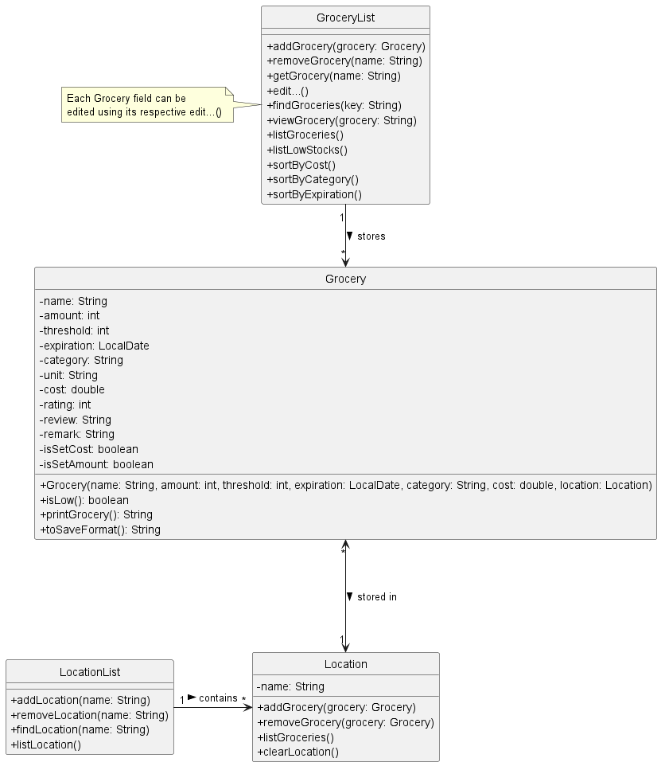

# Willson Han Zhekai - Project Portfolio Page

## Overview
Grocery in Time (GiT) is a **grocery tracker app**, optimised for use via a Command Line Interface (CLI).
It allows users to track and manage their groceries around their home easily.


### Summary of Contributions

#### Code contributed: [RepoSense link of contributions](https://nus-cs2113-ay2324s2.github.io/tp-dashboard/?search=wallywallywally&breakdown=true&sort=groupTitle%20dsc&sortWithin=title&since=2024-02-23&timeframe=commit&mergegroup=&groupSelect=groupByRepos&checkedFileTypes=docs~functional-code~test-code~other)

#### New features and enhancements
1. Ability to **edit** the amount of a grocery
   - `amt GROCERY a/AMOUNT`: Set amount
   - `use GROCERY a/AMOUNT`: Decrease amount after using
2. Functionalities related to **storage locations**
   - `loc LOCATION`: Add location to be tracked
   - `delloc LOCATION`: Remove tracked location
   - `store GROCERY l/LOCATION`: Store grocery in a given location
   - `listloc [LOCATION]`
     - Without `LOCATION`: View all tracked locations
     - With `LOCATION` View groceries stored in given `LOCATION`
   - Loading storage location data
3. Ability to **find** groceries by name: 
   - `find KEYWORD`
4. Improved defensiveness
   - Created custom exceptions with helpful error messages
   - Tested and fixed various bugs

    
#### Contributions to documentation
1. #### User Guide
   - Documentation for various enhancements
     - `add`, `addmulti`, `cat`, `amt`, `use`, `store`, `del`, `find`, `listcat`, `listloc`, `loc`, `delloc`
   - General information
     - Introduction, Quick Start, Command Summary

2. #### Developer Guide
   - Design and implementation details
     - For features `amt`/`use` and `store`
     - Class diagram for `Grocery`, `GroceryList`, `Location`, `LocationList`
     - Sequence diagram for `handleLocationCommands`, `editAmount`, `editLocation`
   - Product scope
     - Target user profile, Value proposition, User stories
   - General information
     - Non-functional requirements, Glossary, Instructions for manual testing


#### Contributions to Team-Based Tasks
- Set up GitHub organisation and repository
- General code enhancements regarding readability, exception handling
- Enhancements to overall formatting and readability for User and Developer Guides
  - Table of Contents
- Maintained issue tracker and milestones
  - Created and delegated issues
- Released v2.0


#### Review/mentoring contributions
As shown in the following PRs: 
[#19](https://github.com/AY2324S2-CS2113-T12-2/tp/pull/19), 
[#52](https://github.com/AY2324S2-CS2113-T12-2/tp/pull/52),
[#89](https://github.com/AY2324S2-CS2113-T12-2/tp/pull/89),
[#151](https://github.com/AY2324S2-CS2113-T12-2/tp/pull/151)


#### Contributions beyond the project team
* Reviewed another team's Developer Guide: [SuperTracker](https://github.com/nus-cs2113-AY2324S2/tp/pull/41)
* Reported bugs for another team's program during the Practical Exam Dry Run: [BinBash](https://github.com/AY2324S2-CS2113T-T09-2/tp)


&nbsp;
## Examples of documentation contributions

## 1. Extracts from the User Guide

### [Listing storage locations and their groceries: `listloc`](../UserGuide.md#listing-storage-locations-and-their-groceries-listloc)
View all storage locations being tracked, or the groceries stored in a given location

Format: `listloc [LOCATION]`

* `LOCATION` is an optional parameter.
    * Without `LOCATION`, all storage locations will be displayed.
    * With `LOCATION`, all groceries in the given `LOCATION` will be displayed.
* More information on storage locations can be found [here](../UserGuide.md#manage-storage-locations).

Example of usage:

* `listloc`: All storage locations are displayed.

```
>> listloc

Here's all the locations you are tracking:
- spice rack
- freezer
- cubby
```

* `listloc cubby`: All groceries in `cubby` are displayed.

```
>> listloc cubby

Viewing location: cubby
Here are your groceries!
- cheese (dairy), amount: 50, location: cubby
- pasta (carbs), cost: $2.95, location: cubby
```

## 2. Extracts from the Developer Guide

### [Grocery Management Mode](../DeveloperGuide.md#4-grocery-management-mode)

Below is a class diagram showing the associations between the `Grocery`, `GroceryList`, `Location`, and `LocationList` classes.




### [handleLocationCommands](../DeveloperGuide.md#43-handlelocationcommands)


`LOC` and `DELLOC` adds and deletes storage locations.
`LISTLOC [LOCATION]` shows all locations or groceries at a given location, depending on whether a location was passed.


### [Edit grocery amount](../DeveloperGuide.md#6-edit-grocery-amount)
* A `Grocery` stores its `amount` as an attribute. All `Grocery` objects are then stored in an ArrayList in `GroceryList`, which entirely handles the editing of the `amount`.


* `GroceryList+editAmount()` is used to either decrease or directly set the `amount` of a `Grocery`. It takes in 2 parameters:
  1. details: String — User input read from `Scanner`.
  2. use: boolean — `true` decreases the `amount`, while `false` directly sets it.
*  To set the `amount` of a `Grocery`, the user inputs `amt GROCERY a/AMOUNT`.
* To edit the `amount` after using a `Grocery`, the user inputs `use GROCERY a/AMOUNT`.
* Our app then executes `GroceryList+editAmount()` with parameter `use = false` or `true` respectively, as illustrated by the following sequence diagram.


* Additional checks specific to `use` ensure that the user only inputs a valid `int`, or that the `amount` must not be 0 beforehand.
* Any exceptions thrown come with a message to help the user remedy their specific issue, as displayed by the `Ui`.